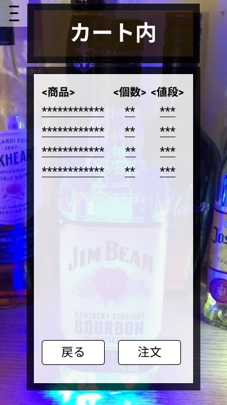

*****

*****

補足：対応DBの列はDB設計後、〇を対応するテーブル・カラム名に差し替えること
|ID   |要素   |内容   |アクション|イベント |対応ＤＢ |
|-----|-------|-------|---------|---------|---------|
|1    |カート内|テキスト表示|-    |-       |-       |
|2    |<商品> |テキスト表示|-   |-   |-   |
|3    |<個数> |テキスト表示|-   |-   |-   |
|4    |<値段> |テキスト表示|-   |-   |-   |
|5    |＊＊＊＊|テキスト表示|-   |-   |-    |
|6    |Ξ      |ボタン|クリック|サイドバー表示|-  |
|7    |戻る　|ボタン |クリック|商品一覧へ移動|-|
|8    |注文　|ボタン |クリック|注文先へ移動|-|
