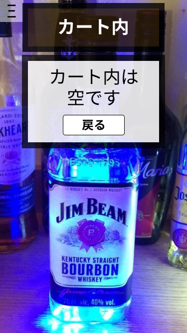

*****

*****

補足：対応DBの列はDB設計後、〇を対応するテーブル・カラム名に差し替えること
|ID   |要素   |内容   |アクション|イベント |対応ＤＢ |
|-----|-------|-------|---------|---------|---------|
|1    |カート内|テキスト表示|-   |-        |-       |
|2    |カート内は空です|テキスト表示|-     |-      |-  |
|3    |戻る   |ボタン|クリック|商品一覧へ移動|- |-   |
|4    |Ξ      |ボタン |クリック |サイドバー表示|-    |
