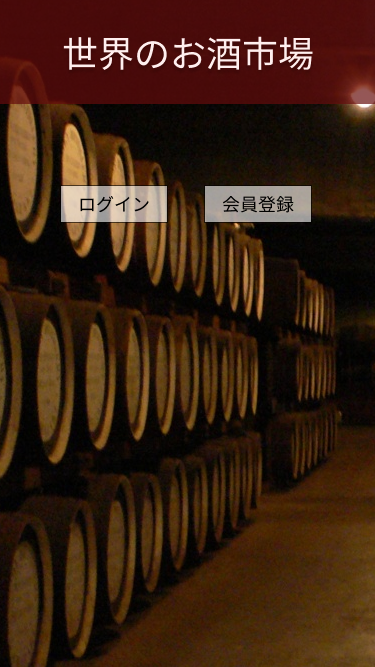

  
### 画面詳細図
## トップページ
### プロトタイプは以下のリンク先
[プロトタイプ](https://www.figma.com/file/aI9C3rSlhTfjsNoUP5x3XV/Untitled?node-id=3%3A2)

補足：対応DBの列はDB設計後、〇を対応するテーブル・カラム名に差し替えること
*****

*****

### トップページ
|ID   |要素   |内容   |アクション|イベント |対応ＤＢ |
|-----|-------|-------|---------|---------|---------|
|1-1  |バナー |サイト名表示|-    |-        |-        |
|1-2  |ログインボタン|ボタン|クリック|ログイン画面移動|-|
|1-3  |会員登録ボタン|ボタン|クリック|会員登録画面移動|-|

*****

*****

### トップページ(ログイン)
|ID   |要素   |内容   |アクション|イベント |対応ＤＢ |
|-----|-------|-------|---------|---------|---------|
|2-1  |バナー |サイト名表示|-    |-        |-        |
|2-2  |ID:    |テキスト表示|-   |-         |-        |
|2-3  |ID     |入力欄|テキスト入力|-      |-         |
|2-4  |Pass:  |テキスト表示|-   |-        |-         |
|2-5  |Pass   |入力欄|テキスト入力|-      |-         |
|2-6  |トップページボタン|ボタン|クリック|トップページへ移動|-|
|2-7  |ログインボタン|ボタン|クリック|商品一覧へ移動|-|

