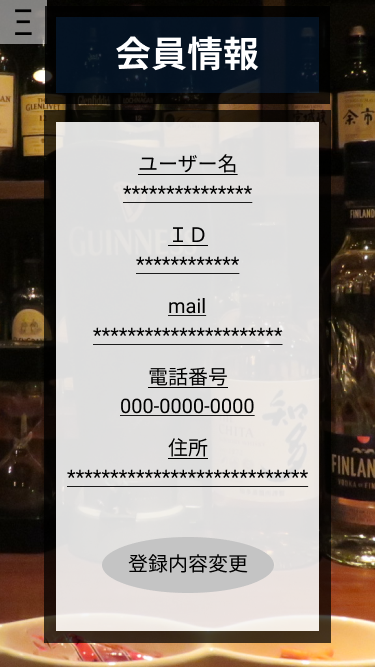

*****

*****

補足：対応DBの列はDB設計後、〇を対応するテーブル・カラム名に差し替えること
|ID   |要素   |内容   |アクション|イベント |対応ＤＢ |
|-----|-------|-------|---------|---------|---------|
|1    |会員情報|テキスト表示|-    |-         |-       |
|2    |Ξ　　　|ボタン|クリック|サイドバー表示|-      |
|3    |ユーザー名|テキスト表示|-   |-       |-       |
|4    |＊＊＊＊＊|ユーザー名表示|-   |-       |-       |
|5    |ID       |テキスト表示|-   |-       |-       |
|6    |＊＊＊＊＊|登録ID表示     |-   |-       |-       |
|7    |mail       |テキスト表示|-   |-       |-       |
|8    |＊＊＊＊＊|登録mail表示     |-   |-       |-       |
|9    |電話番号  |テキスト表示|-   |-       |-       |
|10   |000-0000-0000|登録電話番号表示     |-   |-       |-       |
|11   |住所      |テキスト表示|-   |-       |-       |
|12   |＊＊＊＊＊|登録住所表示     |-   |-       |-       |
|13   |登録内容変更ボタン|ボタン|クリック|登録変更画面へ移動|-|-|
