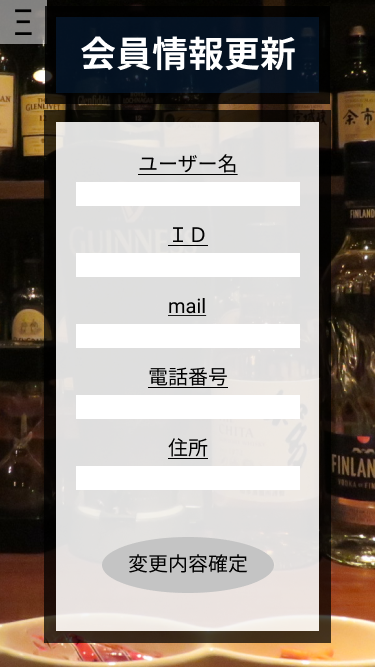

*****

*****

補足：対応DBの列はDB設計後、〇を対応するテーブル・カラム名に差し替えること
|ID   |要素   |内容   |アクション|イベント |対応ＤＢ |
|-----|-------|-------|---------|---------|---------|
|1    |会員情報更新|テキスト表示|-    |-         |-       |
|2    |ユーザー名|テキスト表示|-    |-         |-       |
|3    |ユーザー名|入力欄  |テキスト入力|-  |-       |
|4    |ID     |テキスト表示|-     |-   |-       |
|5    |ID     |入力欄　|テキスト入力|-   |-     |
|6    |mail   |テキスト表示|-     |-       |-      |
|7    |mail   |入力欄 |テキスト入力|-     |-       |
|8    |電話番号|テキスト表示|-   |-        |-       |
|9    |電話番号|入力欄 |テキスト入力|-    |-       |
|10   |住所　　|テキスト表示|-   |-       |-       |
|11   |住所    |入力欄|テキスト入力|-     |-       |
|12   |変更内容確認|ボタン|クリック|更新完了画面へ移動|-       |
