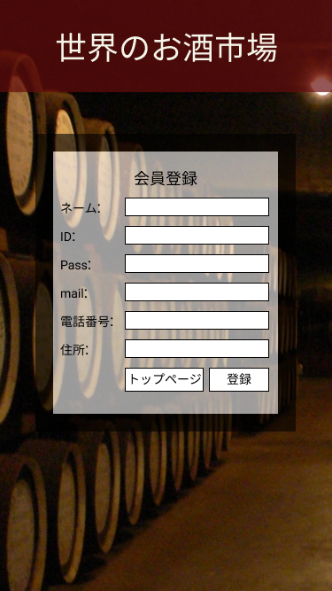

*****

*****

補足：対応DBの列はDB設計後、〇を対応するテーブル・カラム名に差し替えること
|ID   |要素   |内容   |アクション|イベント |対応ＤＢ |
|-----|-------|-------|---------|---------|---------|
|1    |バナー |サイト名表示|-    |         -|       -|
|2    |会員登録|テキスト表示|-   |-        |-        |
|3    |ネーム:|テキスト表示|-    |-        |-        |
|4    |ネーム|入力欄|テキスト入力|-        |-        |
|5    |ID:    |テキスト表示|-    |-        |-        |
|6    |ID     |入力欄|テキスト入力|-        |-        |
|7    |Pass:  :|テキスト表示|-    |-        |-        |
|8    |Pass|入力欄|テキスト入力|-        |-        |
|9    |mail:|テキスト表示|-    |-        |-        |
|10   |mail|入力欄|テキスト入力|-        |-        |
|11   |電話番号:|テキスト表示|-    |-        |-        |
|12   |電話番号|入力欄|テキスト入力|-        |-        |
|13   |住所:|テキスト表示|-    |-        |-        |
|14   |住所|入力欄|テキスト入力|-        |-        
|15   |トップページボタン|ボタン|クリック|トップページへ移動|-|
|16   |登録ボタン|ボタン|クリック|完了画面表示|-|
