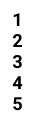

*****

*****

補足：対応DBの列はDB設計後、〇を対応するテーブル・カラム名に差し替えること
|ID   |要素   |内容   |アクション|イベント |対応ＤＢ |
|-----|-------|-------|---------|---------|---------|
|1    |1      |ボタン|クリック|個数選択して閉じる|-|
|2    |2      |ボタン|クリック|個数選択して閉じる|-|
|3    |3      |ボタン|クリック|個数選択して閉じる|-|
|4    |4      |ボタン|クリック|個数選択して閉じる|-|
|5    |5      |ボタン|クリック|個数選択して閉じる|-|
