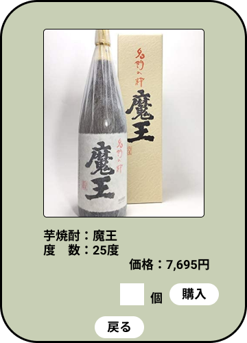

*****

*****

補足：対応DBの列はDB設計後、〇を対応するテーブル・カラム名に差し替えること
|ID   |要素   |内容   |アクション|イベント |対応ＤＢ |
|-----|-------|-------|---------|---------|---------|
|1    |商品画像|画像   |-       |-         |-        |
|2    |商品名|テキスト表示|-    |-    |-       |
|3    |アルコール度数|テキスト表示|-  |-    |-      |
|4    |価格  |テキスト表示|-    |-        |-       |
|5    |□　　　|ボタン|クリック|個数選択表示|-      |
|6    |個     |テキスト表示|-    |-        |-       |
|7    |購入   |ボタン  |クリック|確認画面表示|-    |
|8    |戻る   |ボタン　|クリック|商品一覧へ移動|
