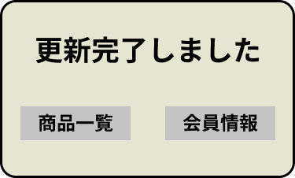

*****

*****

補足：対応DBの列はDB設計後、〇を対応するテーブル・カラム名に差し替えること
|ID   |要素   |内容   |アクション|イベント |対応ＤＢ |
|-----|-------|-------|---------|---------|---------|
|1    |更新完了しました|テキスト表示|-|-   |-        |
|2    |商品一覧|ボタン|クリック|商品一覧へ移動|-     |
|3    |会員情報|ボタン|クリック|会員情報へ移動|-     |
