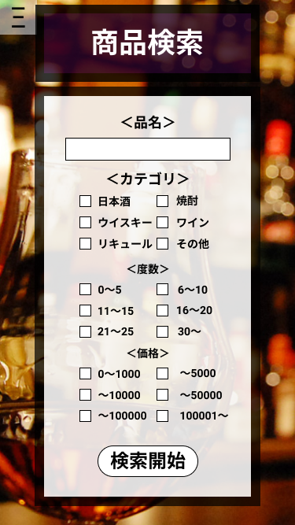

*****

*****

補足：対応DBの列はDB設計後、〇を対応するテーブル・カラム名に差し替えること
|ID   |要素   |内容   |アクション|イベント |対応ＤＢ |
|-----|-------|-------|---------|---------|---------|
|1    |商品検索|テキスト表示|-     |-        |-        |
|2    |<品名> |テキスト表示|-     |-       |-        |
|3    |品名　　|入力欄|テキスト入力|-      |-       |
|4    |<カテゴリ>|テキスト表示|-   |-      |-        |
|5    |カテゴリ名|テキスト表示|-   |-      |-        |
|6    |カテゴリ□|チェックボックス|チェック|-|-      |
|7    |<度数> |テキスト表示|-     |-       |-       |
|8    |度数 |テキスト表示|-      |-        |-        |
|9    |度数□|チェックボックス|チェック|-   |-        |
|10   |<価格>|テキスト表示|-    |-         |-        |
|11   |価格|テキスト表示|-      |-        |-         |
|12   |価格□|チェックボックス|チェック|-  |-         |
|13   |検索開始|ボタン |クリック|検索結果(商品一覧)へ移動|-|
