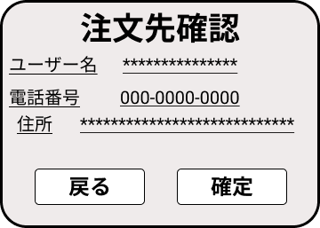

*****

*****

補足：対応DBの列はDB設計後、〇を対応するテーブル・カラム名に差し替えること
|ID   |要素   |内容   |アクション|イベント |対応ＤＢ |
|-----|-------|-------|---------|---------|---------|
|1    |注文先確認|テキスト表示|- |-        |-        |
|2    |ユーザー名|テキスト表示|- |-        |-        |
|3    |＊＊＊＊＊|テキスト表示|- |-        |-        |
|4    |電話番号|テキスト表示|- |-        |-        |
|5    |000-0000-000|テキスト表示|- |-        |-        |
|6    |住所|テキスト表示|- |-        |-        |
|7    |＊＊＊＊＊|テキスト表示|- |-        |-        |
|8    |戻る|ボタン|クリック|カート内へ移動|-  |
|9    |確定 |ボタン |クリック |確定画面表示|-   |
