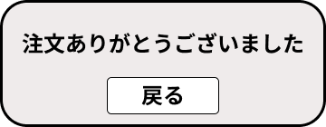

*****

*****

補足：対応DBの列はDB設計後、〇を対応するテーブル・カラム名に差し替えること
|ID   |要素   |内容   |アクション|イベント |対応ＤＢ |
|-----|-------|-------|---------|---------|---------|
|1    |注文ありがとうございました|テキスト表示|-|-|-|
|2    |戻る　|ボタン　|クリック |商品一覧へ移動|-    |
